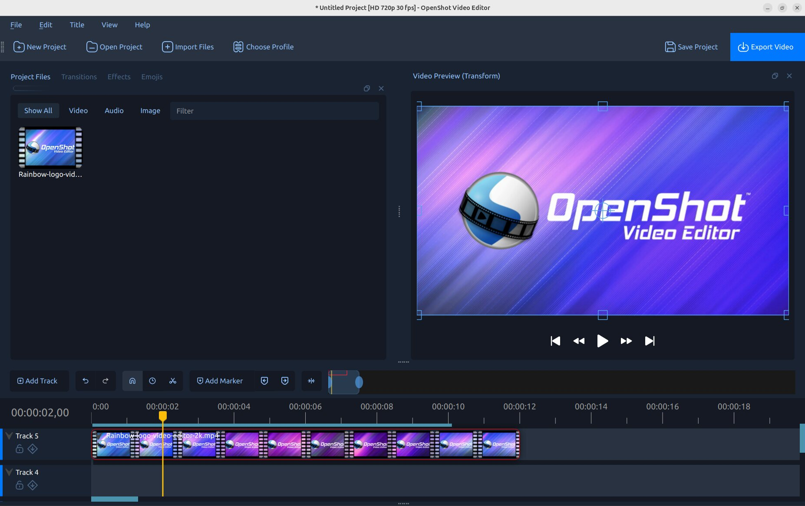

.. Copyright (c) 2008-2026 SmartEdit Studios, LLC
 (http://www.smarteditstudios.com). This file is part of
 SmartEdit Video Editor (http://www.smartedit.org), an open-source project
 dedicated to delivering high quality video editing and animation solutions
 to the world.

.. SmartEdit Video Editor is free software: you can redistribute it and/or modify
 it under the terms of the GNU General Public License as published by
 the Free Software Foundation, either version 3 of the License, or
 (at your option) any later version.

.. SmartEdit Video Editor is distributed in the hope that it will be useful,
 but WITHOUT ANY WARRANTY; without even the implied warranty of
 MERCHANTABILITY or FITNESS FOR A PARTICULAR PURPOSE.  See the
 GNU General Public License for more details.

.. You should have received a copy of the GNU General Public License
 along with SmartEdit Library.  If not, see <http://www.gnu.org/licenses/>.

SmartEdit User Guide
===================

SmartEdit Video Editor is a free, award-winning, open-source video editor, available on
Linux, Mac, Chrome OS, and Windows. SmartEdit can create stunning videos, films, and animations with an
easy-to-use interface and rich set of features.

Table of Contents:
------------------

.. toctree::
   :maxdepth: 2

   introduction
   installation
   quick_tutorial
   getting_started
   main_window
   timeline
   recording
   files
   clips
   transitions
   effects
   color
   export
   animation
   titles
   profiles
   import_export
   preferences
   playback
   ai
   troubleshoot
   developers
   contributing
   learn_more
   glossary
