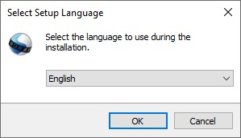
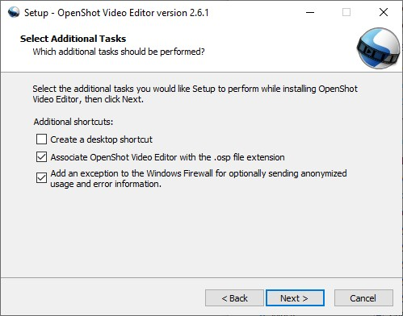
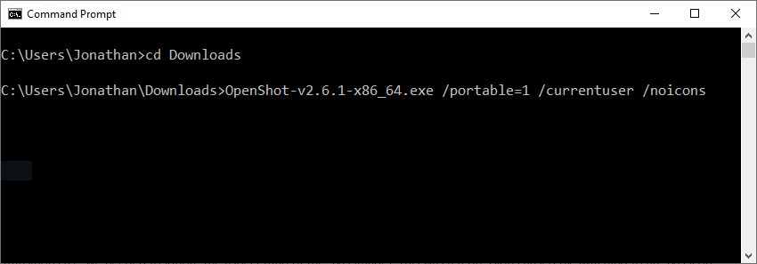
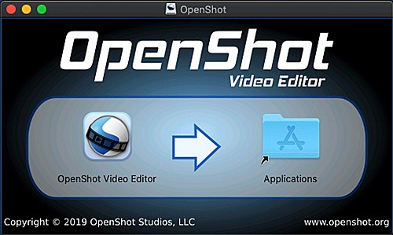
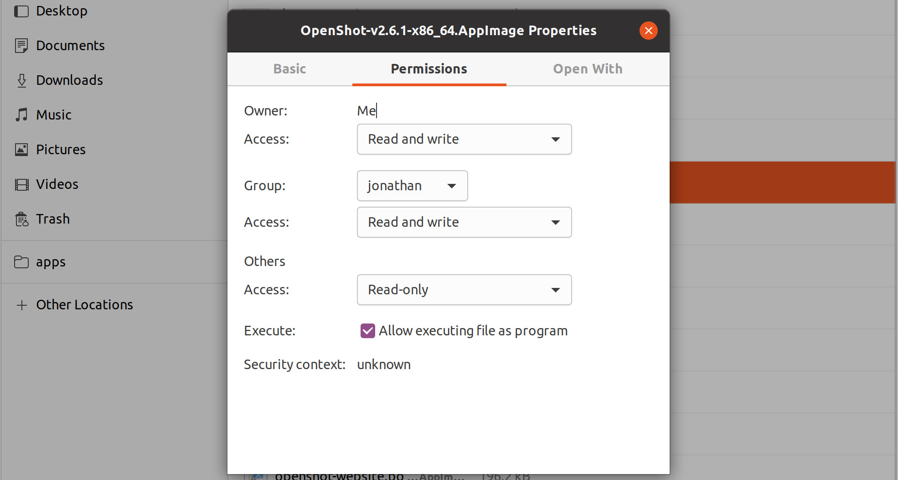

.. Copyright (c) 2008-2026 SmartEdit Studios, LLC
 (http://www.smarteditstudios.com). This file is part of
 SmartEdit Video Editor (http://www.smartedit.org), an open-source project
 dedicated to delivering high quality video editing and animation solutions
 to the world.

.. SmartEdit Video Editor is free software: you can redistribute it and/or modify
 it under the terms of the GNU General Public License as published by
 the Free Software Foundation, either version 3 of the License, or
 (at your option) any later version.

.. SmartEdit Video Editor is distributed in the hope that it will be useful,
 but WITHOUT ANY WARRANTY; without even the implied warranty of
 MERCHANTABILITY or FITNESS FOR A PARTICULAR PURPOSE.  See the
 GNU General Public License for more details.

.. You should have received a copy of the GNU General Public License
 along with SmartEdit Library.  If not, see <http://www.gnu.org/licenses/>.

Installation
============

The latest official **stable** version of SmartEdit Video Editor for Linux,
Mac, Chrome OS, and Windows can be downloaded from the official download page at
https://www.smartedit.org/download/. You can find our latest **unstable** versions
(i.e. daily builds) at https://www.smartedit.org/download#daily (these versions are
updated very frequently, and often contain many improvements not yet released in our stable
build).

Clean Install
^^^^^^^^^^^^^

If you are upgrading from a previous version of SmartEdit or are experiencing a crash or error
message after launching SmartEdit, please see :ref:`preferences_reset_ref` for instructions on clearing
the previous ``smartedit.settings`` file (for a clean install with **default preferences**).

Windows (Installer)
^^^^^^^^^^^^^^^^^^^

Download the Windows installer from the `official download page
<https://www.smartedit.org/download/>`_ (the download page contains both 64-bit and
32-bit versions), double click it, and follow the directions on screen. Once completed,
SmartEdit will be installed and available in your Start menu.

Windows (Portable)
^^^^^^^^^^^^^^^^^^

If you need to install SmartEdit on Windows without Administrator permissions,
we also support a portable installation process. Download the Windows installer
from the `official download page <https://www.smartedit.org/download/>`_, open the command prompt,
and type the following commands:

..  code-block:: console

    :caption: Install portable version of SmartEdit (no administrator permissions required)

    cd C:\Users\USER\Downloads\
    SmartEdit-v2.6.1-x86_64.exe /portable=1 /currentuser /noicons

Mac
^^^

Download the DMG file from the `official download page
<https://www.smartedit.org/download/>`_, double click it, and then drag the SmartEdit application
icon into your **Applications** shortcut. This is very similar to how most Mac applications are
installed. Now launch SmartEdit from `Launchpad` or `Applications` in Finder.

Linux (AppImage)
^^^^^^^^^^^^^^^^

Most Linux distributions have a version of SmartEdit in their software
repositories, which can be installed using your package manager / software store.
However, these packaged versions are often very outdated (be sure to check the version number:
:guilabel:`Help→About SmartEdit`). For this reason, we recommend installing an AppImage from the
`official download page <https://www.smartedit.org/download/>`_.

Once downloaded, right click on the AppImage, choose Properties, and mark the file as **Executable**.
Finally, double click the AppImage to launch SmartEdit. If double clicking does not launch SmartEdit, you can also
right click on the AppImage, and choose `Execute` or `Run`. For a detailed guide on installing our AppImage
and creating a launcher for it, see our
`AppImage Installation Guide <https://github.com/SmartEdit/smartedit-qt/wiki/AppImage-Installation>`_.

Unable to Launch AppImage?
~~~~~~~~~~~~~~~~~~~~~~~~~~
Please verify that the ``libfuse2`` library is installed, which is required to mount and read an AppImage.
On newer versions of Ubuntu (i.e. 22.04+), ``libfuse2`` is not installed by default. You can install it with
the following command:

..  code-block:: console

    sudo apt install libfuse2

Install AppImage Launcher
~~~~~~~~~~~~~~~~~~~~~~~~~
If you plan on using SmartEdit often, you will probably want an integrated launcher for our AppImage.
We recommend using AppImageLauncher, which is the officially supported way to launch (and manage) AppImage files on
your Linux desktop. If you are on a Debian-based distro (Ubuntu, Mint, etc...), there is an official
AppImageLauncher PPA:

..  code-block:: console

    sudo add-apt-repository ppa:appimagelauncher-team/stable
    sudo apt update
    sudo apt install appimagelauncher

Linux (PPA)
^^^^^^^^^^^

For Debian-based Linux distributions (Ubuntu, Mint, etc...), we also have a PPA
(Personal Package Archive), which adds our official SmartEdit software repository to your package
manager, making it possible to install our latest version, without relying on our AppImages.

Stable PPA (Contains only official releases)
~~~~~~~~~~~~~~~~~~~~~~~~~~~~~~~~~~~~~~~~~~~~

..  code-block:: console

    sudo add-apt-repository ppa:smartedit.developers/ppa
    sudo apt update
    sudo apt install smartedit-qt python3-smartedit

Daily PPA (Highly experimental and unstable, for testers)
~~~~~~~~~~~~~~~~~~~~~~~~~~~~~~~~~~~~~~~~~~~~~~~~~~~~~~~~~

..  code-block:: console

    sudo add-apt-repository ppa:smartedit.developers/libsmartedit-daily
    sudo apt update
    sudo apt install smartedit-qt python3-smartedit

Chrome OS (Chromebook)
^^^^^^^^^^^^^^^^^^^^^^

Chrome OS supports Linux apps, but this feature is off by default. You can turn it on in *Settings*.
Once Linux is enabled, you can install and run SmartEdit Linux AppImages on any *x86-based*
Chromebook. The command below will download our AppImage and configure your system to run
SmartEdit successfully.

- Navigate to *chrome://os-settings/crostini* (Copy/Paste)
- Under "Linux (Beta)" select "Turn On". Default values are fine.
- When the Terminal appears (i.e. black window), Copy/Paste the following command:
    - ``bash <(wget -O - http://smartedit.org/files/chromeos/install-stable.sh)``

Previous Versions
^^^^^^^^^^^^^^^^^

To download old versions of SmartEdit Video Editor, you can visit https://github.com/SmartEdit/smartedit-qt/tags.
Click on the version number you need, and scroll to the bottom, under the release notes. You will find
download links for each operating system. Download the appropriate version for your computer, and
follow the installation instructions above.

NOTE: Projects (\*.osp) made with newer versions of SmartEdit Video Editor might not support older versions.

Uninstall
^^^^^^^^^

To fully uninstall SmartEdit from your system, you must **manually delete** the ``.smartedit_qt`` folder:
``~/.smartedit_qt/`` or ``C:\Users\USERNAME\.smartedit_qt\``, which contains all
settings and files used by SmartEdit. Be sure to **backup** any recovery files of your existing
projects first (\*.osp files). Please see :ref:`preferences_reset_ref` for instructions on clearing
the previous ``smartedit.settings`` file (for a clean install with **default preferences**).

Windows
~~~~~~~

#. Open **Control Panel** from the Start menu
#. Click on **Programs and Features**
#. Select SmartEdit Video Editor, then click **Uninstall**

Mac
~~~

#. Open **Finder** and go to **Applications**
#. Drag the SmartEdit Video Editor icon to the **Trash** in the Dock
#. Right-click **Trash** and choose **Empty Trash**

Ubuntu (Linux)
~~~~~~~~~~~~~~

#. Open up **Files**
#. Locate the ``*.AppImage`` and delete the file
#. OR click Activities, Right-click on SmartEdit Video Editor icon, and choose **Remove AppImage from System**
