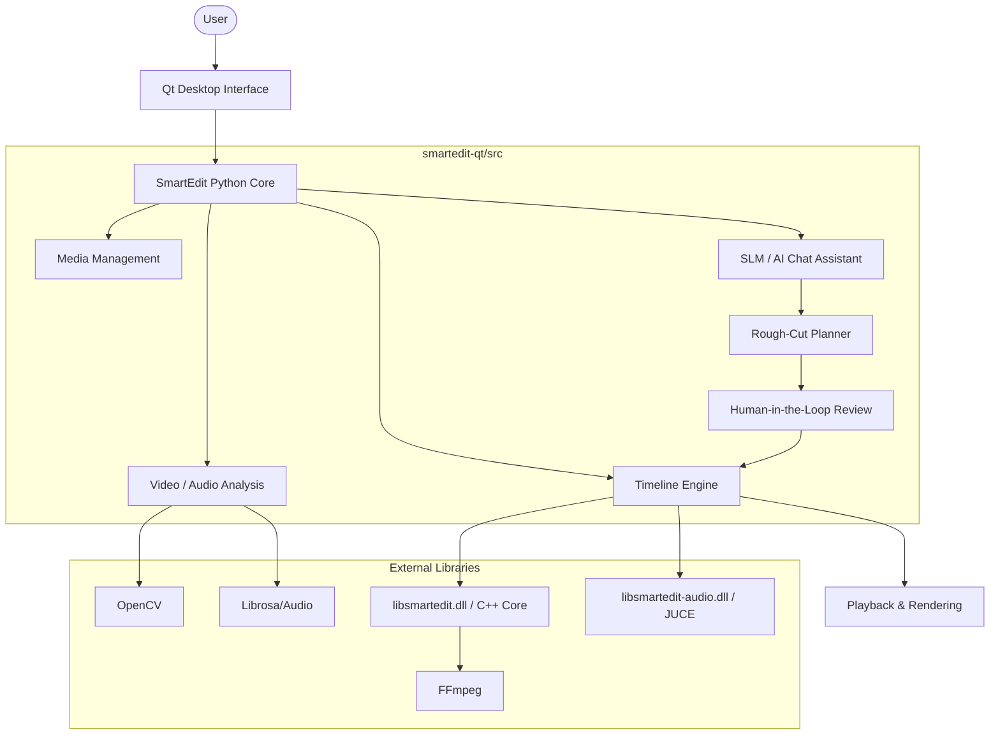

# SmartEdit Code Architecture

## Description of Layers

- **Qt UI**: The presentation layer written in PyQt5.
- **SmartEdit Python Core**: The business logic orchestration layer.
- **Media / Timeline**: Manages media files, clips, tracking, and non-destructive properties.
- **Analysis**: Video and audio processing (Scene detection, shaky detection, silence detection). Uses OpenCV for visual analysis.
- **SLM & Rough-Cut Planner**: Interprets user commands into discrete editing `operations` and proposes `AIPlan` items to the user.
- **Human-in-the-Loop**: Presents proposed plans to the user before applying destructive timeline edits.
- **libsmartedit / FFmpeg**: The pre-compiled C++ multimedia backend (originally derived from OpenShot) that handles the actual frame rendering and video decoding via FFmpeg.
